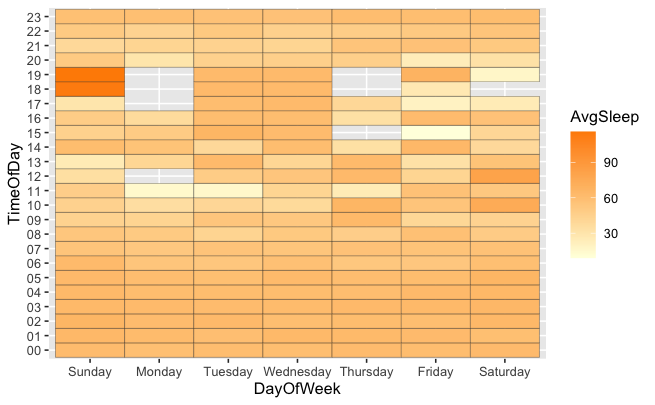

---
title: "Report"
author: "Sriharini Radhakrishnan Madanraj"
output: pdf_document
---

### **Analysis of User Activity and Sleep data recorded by Bellabeat fitness Tracker.**

### Introduction

Bellabeat a high-tech manufacturer of health-focused products for women. It's a successful small company, aiming to leaverage it's strngths to become a larger player in the global smart device market. The focus of this Report is to use the data collected from their smart device to gain insight into how consumers are using their smart devices. This analysis can be used to gain more information on Consumer Usage and Device Performance based on the Activity and Sleep related data.

### Data Analysis

The dailyAcivity_merged.csv is used for Activity data as it contains the most comprehensive data including the calories, intensity, distance, and steps recorded everyday and is used in conjunction with Sleep data from sleepDay_merged.csv to analyse the correlation between them.

First the libraries needed for analysis were loaded. Here, tidyverse is employed for data analysis and visualization. Additionally, corrplot was used for making correlation matrix later in analysis.

The columns, its values and datatypes were examined and feasibility of joining the two tables was evaluated.

The format, data type and the name of the date column was found to be inconsistent in both tables. Hence, those changes were made and the tables were recheched for suitable transformations.

Next, a new column was added to contain the minutes taken by the user to fall sleep. Once again, the tables were checked to make sure of its readiness for joining.

As a following step the merged table daily_activity_and_sleep containing the sleep and activity table joined using Id and Date as reference columns was created.

The column "DayOfWeek" which assigns the respective day of the week to the dates in the dataset was also added.

Next-up, was the creation of a table for correlation matrix. This table was scaled to contain only numerical values to enable the use of function on the dataset. Additionally, the observations with "NA" on sleep data was dropped to prevent it from affecting the correlation coefficient.

Here is the correlation matrix that includes the sleep variables that we joined earlier in the analysis:

Based on the Correlation Plot, the following conculsions were made:

-   TotalSteps and TotalDistance have very high correlation, so they are basically the same variable.

-   Other significant correlations that can be observed with TotalSteps/TotalDistance are VeryActiveDistance, VeryActiveMinutes, ModeratelyActiveDistance and FairlyActiveMinutes.

-   Point to be noted is even LightActiveDistance has a decently high positive correlation with Calories burned.

-   Whereas, SedentaryMinutes has almost no positive or small negative effect on Calories burned.

-   In addition, all the sleep variables has low negative correlation on calories burned.

If considered Calories Burned is proportional to being a "Health-Conscious" person. These observations signify the importance of even minimal physical activity on the body.

To stay true to the initial objective of this analysis The next part also dealt with plotting coorelation between sleep and activity. The TotalSteps and TotalDistance were also plotted to exhibit how a strongly correlated variables would look when plotted. On examining the coorelation between variables Calories, TotalMinutesAsleep, TotalSteps, no strong correlations were found between them atleast in this particular dataset.

After establishing there is no significant correlation between them at least in this dataset, as a final part of this analysis, the Activity and Sleep was explored in a Time-Series keeping Days of the Week and Hours of the day as the key factors. First, hourlySteps_merged.csv was read in as hourly_steps, and checked for the viability of the variables for analysis using head function. The date variable was made consistent and another variable, days of the week was added to the corresponding date Then visualized, I as a heat map using ggplot geom_tile. Additionally, a bar chart was mode to show how the average steps differ over the week.

The steps data analysis shows that the average steps is greater on Saturdays, and lower on Sundays when compared with the data recorded monday through friday. There is a sharp rise from Sunday to Monday and from Friday to Saturday. Although these data is not conculsive, the general human Psychology associated with workdays and holidays is reflected in this plot.

For sleep data, the previous steps were adapted to analyse them in similar manner.

It was noted that the sleep data contained some null fields and hypothesised to be due to the wearer removing the device at that time or the device stopping to recording because of low-battery or other technical issues.There were also several day time sleep record indicating that the device did not record the sleep pattern accurately due to the device not worn and set to assume that the user is sleeping or alternatively, possible issues with timezome. Hence, the sleep data quality is identified to be unreliable to various reasons mentioaned above.

### Conclusion

The devices's performance can be improved by collecting and analyzing more User data in future. In this particular dataset, the variables were often inconclusive and didnot aid in painting the whole picture. These type of data can be of great use to the company (in R&D and Marketing) as well to the Users(better habit tracking) and serve as a major game-changer.
